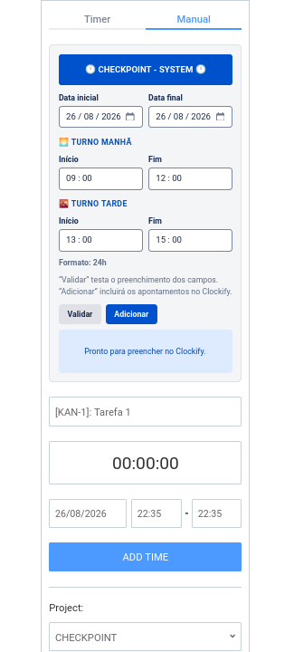
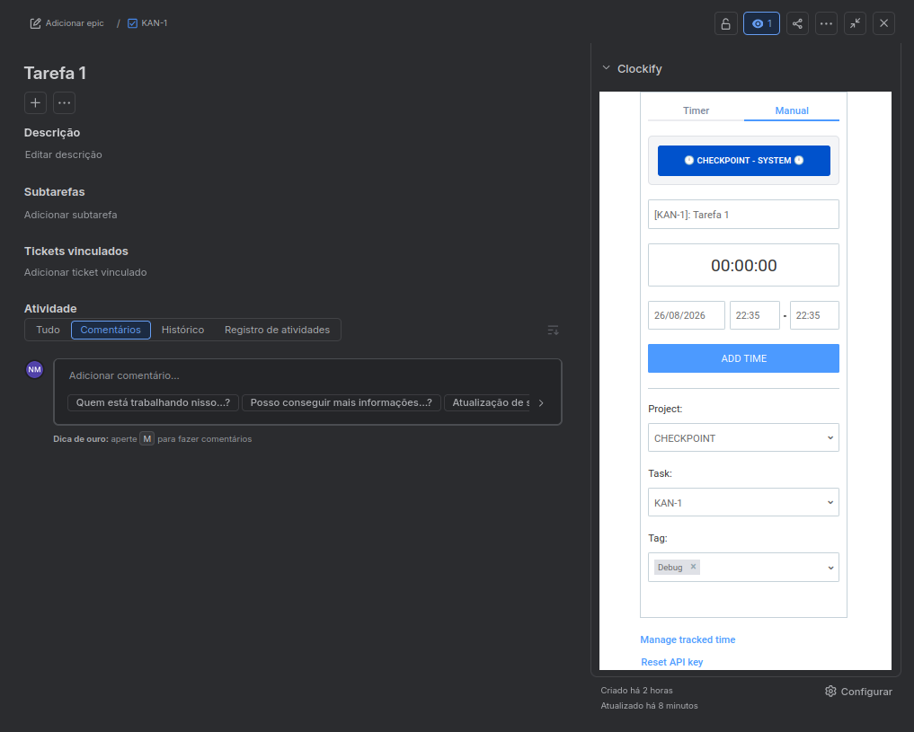

# Clockify no Jira — Apontamentos em Lote

Userscript para automatizar o preenchimento e a inclusão de apontamentos em lote no **Clockify**, integrado ao painel Manual utilizado dentro do Jira.

A ferramenta permite informar um intervalo de datas e configurar os horários dos turnos da manhã e da tarde, preenchendo automaticamente os apontamentos para cada dia útil.

<p align="center">
  
</p>

## ✨ Funcionalidades

- 📅 Seleção de data inicial e final
- 🌅 Configuração do turno da manhã
- 🌇 Configuração do turno da tarde
- ⏰ Horários no formato de 24 horas
- 🏷️ Utilização da tag selecionada diretamente no Clockify
- 💾 Persistência da tag utilizada nos próximos apontamentos
- 🔍 Modo **Validar** para testar o preenchimento
- ➕ Modo **Adicionar** para inserir os apontamentos no Clockify
- ⏱️ Intervalo entre envios configurável diretamente no código
- 📊 Resumo dos apontamentos processados e eventuais erros

## 🌐 Compatibilidade

O funcionamento foi confirmado nos seguintes navegadores:

- Google Chrome
- Chromium
- Mozilla Firefox

O visual de alguns elementos nativos, como os seletores de data e horário, pode variar de acordo com o navegador e o sistema operacional.

## 🚀 Instalação

### 1. Instale um gerenciador de userscripts

A extensão utilizada e validada no desenvolvimento foi:

- Tampermonkey

### 2. Instale o script

Abra o arquivo:

```text
script.js
```

no seu gerenciador de userscripts e instale-o.

Também é possível criar um novo userscript e copiar o conteúdo do arquivo para ele.

## 📋 Como utilizar

O fluxo de utilização é simples:

1. Acesse o **Clockify**.
2. Vá para a aba **Manual**.
3. Selecione a **tag** que deseja utilizar.
4. Abra o **CHECKPOINT - SYSTEM**.
5. Informe a data inicial e a data final.
6. Configure os horários dos turnos.
7. Utilize **Validar** para testar ou **Adicionar** para realizar os apontamentos.

### 🏷️ Tags

A tag é selecionada **diretamente no formulário Manual do Clockify**.

Ao executar um apontamento, a tag selecionada é salva internamente pelo script e passa a ser utilizada como preferência nos próximos apontamentos.

Por exemplo:

```text
Manual → selecionar "Desenvolvimento"
              ↓
       Abrir o CHECKPOINT
              ↓
        Fazer apontamentos
              ↓
Tag "Desenvolvimento" fica salva
```

Assim, não é necessário configurar a tag dentro do CHECKPOINT.

### 🔄 Como trocar de tag

Para utilizar outra tag, basta voltar para a aba **Manual** e selecionar a nova tag antes de utilizar o sistema.

Por exemplo:

```text
Tag atual:
Desenvolvimento

↓ selecionar outra tag no Manual

Nova tag:
Reunião
```

A nova tag selecionada passa a ser utilizada nos próximos apontamentos e substitui a preferência anterior.

**Não é necessário acessar nenhuma configuração do CHECKPOINT para trocar a tag.**

### 🧹 Como remover a preferência de tag

A preferência é armazenada internamente pelo script.

Caso seja necessário remover completamente essa preferência, ela pode ser apagada pelos dados armazenados pelo gerenciador de userscripts (Tampermonkey).

No uso normal, entretanto, **não é necessário limpar a preferência**: basta selecionar outra tag no Manual para substituí-la.

## 📅 Datas

Informe:

- **Data inicial**
- **Data final**

O script processará somente os **dias úteis** dentro do intervalo informado.

Sábados e domingos são automaticamente ignorados.

## ⏰ Turnos

Configure os horários desejados:

```text
🌅 Turno Manhã
Início: 08:45
Fim:    12:00

🌇 Turno Tarde
Início: 13:00
Fim:    17:45
```

Os horários utilizam o formato de **24 horas**.

Para cada dia útil, o script realiza dois apontamentos: um para o turno da manhã e outro para o turno da tarde.

## 🔍 Validar

O botão **Validar** executa o preenchimento dos campos sem adicionar os apontamentos definitivamente.

É recomendado utilizar essa opção antes de realizar uma inclusão em lote, principalmente quando estiver utilizando o script pela primeira vez.

## ➕ Adicionar

O botão **Adicionar** solicita confirmação antes de realizar a operação.

Após a confirmação, os apontamentos são inseridos no Clockify.

**Confira as datas, horários e a tag antes de confirmar**, pois essa operação adiciona apontamentos reais.

<p align="center">
  
</p>

## ⏱️ Delay entre envios

O intervalo entre os envios é configurável diretamente no código.

No início do script existe:

```js
const DELAY_MS = 1500;
```

Exemplos:

```js
const DELAY_MS = 500;   // 0,5 segundo
const DELAY_MS = 1500;  // 1,5 segundo
const DELAY_MS = 2000;  // 2 segundos
```

Esse valor não é exibido na interface.

## 🔧 Horários padrão

Os horários padrão podem ser encontrados no início do script:

```js
const DEFAULT_CONFIG = Object.freeze({
  morningStart: "08:45",
  morningEnd: "12:00",
  afternoonStart: "13:00",
  afternoonEnd: "17:45",
});
```

Eles também podem ser alterados diretamente pela interface.

## ⚠️ Observações

- O script depende da estrutura atual do painel Manual do Clockify.
- Alterações futuras no HTML ou JavaScript do Clockify podem afetar seu funcionamento.
- A compatibilidade foi confirmada em **Chrome, Chromium e Firefox**.
- O script foi desenvolvido para uso pessoal.
- Recomenda-se utilizar **Validar** antes de adicionar grandes quantidades de apontamentos.
- Confira sempre as datas, horários e a tag antes de confirmar uma inclusão.
- A preferência de tag é armazenada localmente pelo userscript.
- Para trocar a tag, basta selecionar outra no formulário **Manual** do Clockify.

## 📁 Estrutura

```text
.
├── script.js
└── README.md
```

## 👤 Autor

**Nmap02**

Contribuições e melhorias são bem-vindas.

## 📄 Licença

Consulte o arquivo `LICENSE` deste repositório para informações sobre a licença do projeto.
